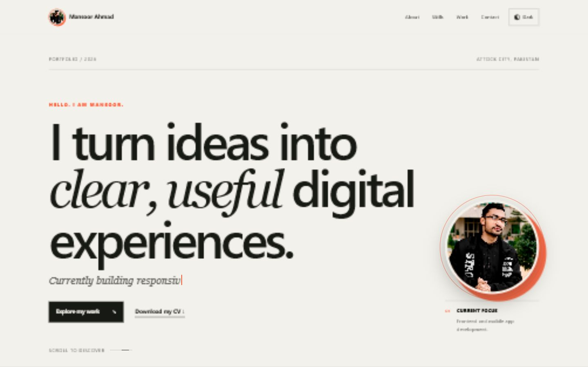
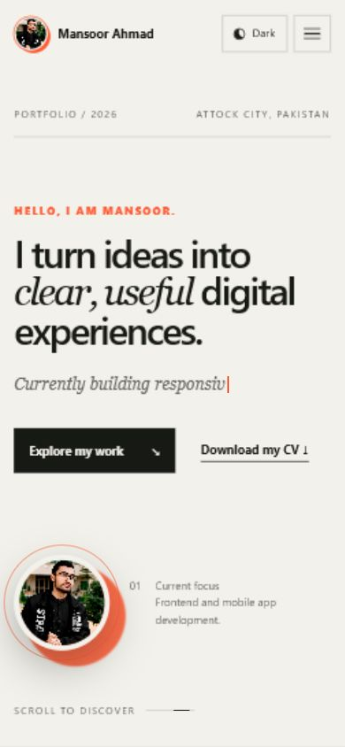

# Mansoor Ahmad — Personal Portfolio

A responsive personal portfolio created for **CloudExify Full Stack Web Development — Month 1, Project 1**. The website follows the **Swiss Editorial** build track and is built entirely with plain static files.

## Submission details

| Field | Details |
| --- | --- |
| Name | Mansoor Ahmad |
| Registration number | `CX-INT-2026-GEN-0210` |
| Build track | Swiss Editorial |
| GitHub repository | [Cloudexify-Web-P1-MansoorAhmad](https://github.com/Mansoor313-sami/Cloudexify-Web-P1-MansoorAhmad) |
| Live Vercel URL | [mansoorahmed-portfolio.vercel.app](https://mansoorahmed-portfolio.vercel.app) |

## About the portfolio

The portfolio introduces Mansoor Ahmad, a BS Software Engineering student at COMSATS University Islamabad, Attock Campus. It presents his technical skills, real mobile application projects, downloadable CV, professional profiles, and contact information in a minimal magazine-inspired layout.

## Technology stack

- HTML5
- CSS3
- Vanilla JavaScript
- No framework
- No package installation
- No build command
- No backend required

## Core features

- Semantic Hero, About, Skills, Projects, Contact, and Footer sections
- Mobile-first responsive design
- Accessible hamburger navigation that closes after a mobile link is selected
- Responsive circular profile photography with visual effects
- Real project screenshot galleries
- Contact form with name, email, and message validation
- Downloadable resume PDF
- Smooth scrolling and active navigation highlighting
- Keyboard-accessible controls and reduced-motion support

## Signature features

Five signature features are implemented:

1. **Live theme switcher** — switches between light and dark themes and saves the preference with `localStorage`.
2. **Typewriter hero introduction** — types and loops through multiple development-focused phrases.
3. **Scroll-triggered skill bars** — animate from zero to their stated percentage once when visible.
4. **Live project filter** — smoothly filters projects by technology or category.
5. **Hidden easter egg** — unlocks an achievement using the Konami code or five logo clicks.

Konami code: `↑ ↑ ↓ ↓ ← → ← → B A`

## Bonus challenges completed

- [x] Downloadable resume PDF button
- [x] Smooth scrolling with active navigation highlighting
- [x] Saved light/dark theme preference
- [x] Swiss Editorial page-load skeleton/loading animation
- [x] More than one signature feature
- [x] Lighthouse performance score above 90

## Lighthouse audit

Latest local audit results:

| Category | Score |
| --- | ---: |
| Performance | **98** |
| Accessibility | **100** |
| Best Practices | **100** |
| SEO | **100** |

The audited page also recorded zero cumulative layout shift and no browser console errors.

## Featured projects

### 1. QuizMate

An all-in-one student productivity application for subjects, attendance, tasks, schedules, exams, reminders, and academic deadlines.

**Technologies:** React Native, Firebase, REST APIs

### 2. Daily Milk Tracker

A mobile application for daily milk and yogurt quantities, editable monthly records, billing summaries, and downloadable PDF reports.

**Technologies:** React Native, CRUD operations, PDF reporting

### 3. Grocery Management App

A category-based grocery list manager with item progress, optional pricing, automatic saving, totals, and PDF export.

**Technologies:** React Native, state management, PDF export

## Contact and profiles

- **Location:** Attock City, Pakistan
- **Email:** [i.mansoor313@gmail.com](mailto:i.mansoor313@gmail.com)
- **GitHub:** [github.com/Mansoor313-sami](https://github.com/Mansoor313-sami)
- **LinkedIn:** [linkedin.com/in/mansoor-ahmad313](https://www.linkedin.com/in/mansoor-ahmad313)

## Project structure

```text
portfolio/
├── index.html
├── css/
│   └── style.css
├── js/
│   └── script.js
├── assets/
│   ├── projects/
│   │   ├── quizmate/
│   │   ├── daily-milk-tracker/
│   │   └── grocery-app/
│   ├── screenshots/
│   ├── Mansoor-Ahmad-CV.pdf
│   └── mansoor-portfolio.jpg
├── .gitignore
├── .vercelignore
└── README.md
```

## Run locally

The project has no dependencies or build step. Open `index.html` directly, or serve the project folder with any static HTTP server.

Example local address:

```text
http://127.0.0.1:4173/
```

## Deployment

The portfolio is publicly deployed on Vercel directly from the GitHub repository.

- **Live website:** [https://mansoorahmed-portfolio.vercel.app](https://mansoorahmed-portfolio.vercel.app)
- **Source code:** [github.com/Mansoor313-sami/Cloudexify-Web-P1-MansoorAhmad](https://github.com/Mansoor313-sami/Cloudexify-Web-P1-MansoorAhmad)
- **Framework preset:** Other / Static
- **Build command:** None

## Verification checklist

- [x] Semantic sections and internal navigation work
- [x] Mobile hamburger menu opens and closes correctly
- [x] Layout adapts without horizontal overflow
- [x] Theme preference survives page reloads
- [x] Typewriter introduction loops correctly
- [x] Skill bars animate once when visible
- [x] Project filters show the correct matching cards
- [x] Contact form rejects empty and invalid input
- [x] All local images, CV, and project assets resolve
- [x] Hidden easter egg works with both unlock methods
- [x] Browser console is free of JavaScript errors
- [x] Public GitHub repository added
- [x] Public Vercel deployment added

## Screenshots

| Desktop | Mobile |
| --- | --- |
|  |  |

## Submission message

```text
[CX-INT-2026-GEN-0210] Web Project 1 Done — GitHub: https://github.com/Mansoor313-sami/Cloudexify-Web-P1-MansoorAhmad | Live: https://mansoorahmed-portfolio.vercel.app
```
